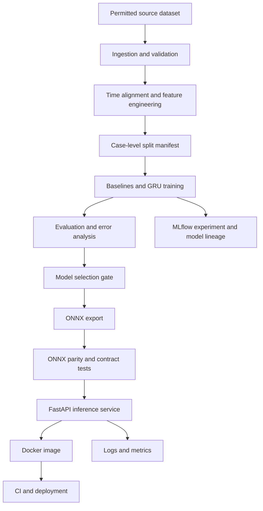

# Architecture — initial target

```mermaid
flowchart TD
    A[Permitted source dataset] --> B[Ingestion and validation]
    B --> C[Time alignment and feature engineering]
    C --> D[Case-level split manifest]
    D --> E[Baselines and GRU training]
    E --> F[Evaluation and error analysis]
    E --> G[MLflow experiment and model lineage]
    F --> H[Model selection gate]
    H --> I[ONNX export]
    I --> J[ONNX parity and contract tests]
    J --> K[FastAPI inference service]
    K --> L[Docker image]
    L --> M[CI and deployment]
    K --> N[Logs and metrics]
```

The initial implementation is a research prototype. Cloud hosting and clinical integration are not part of the first milestone.
